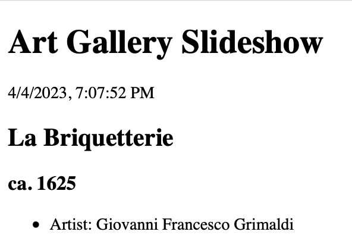
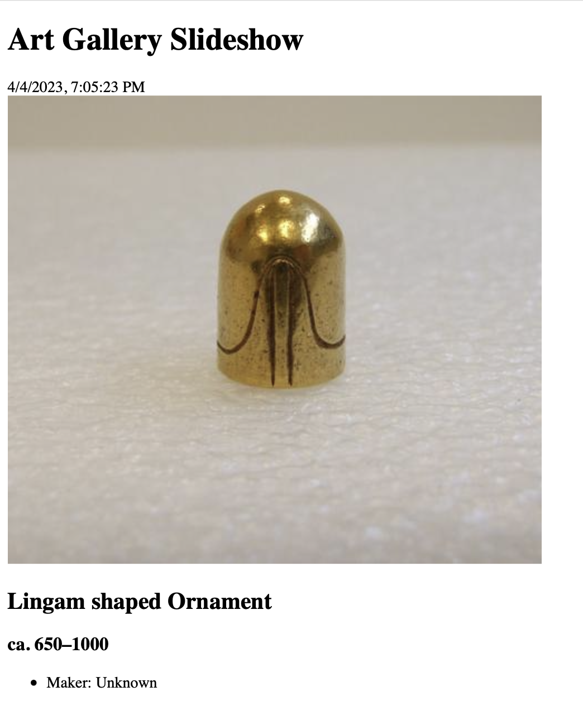
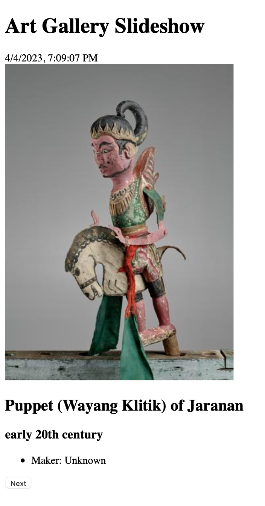
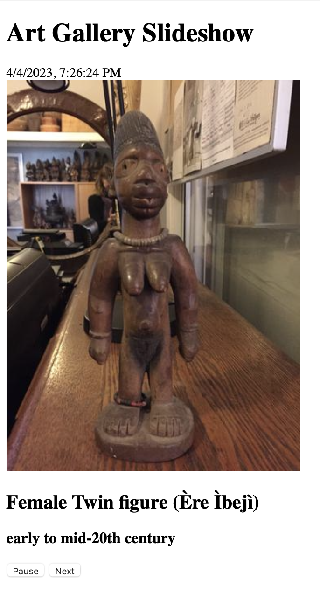
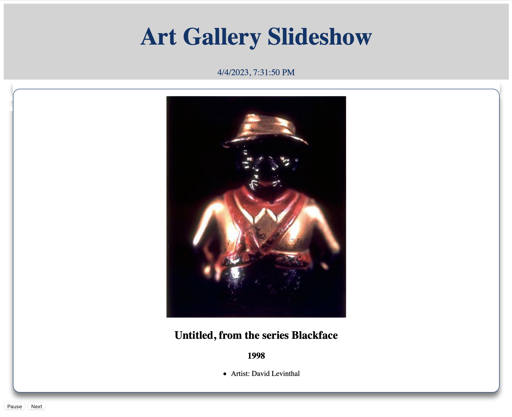
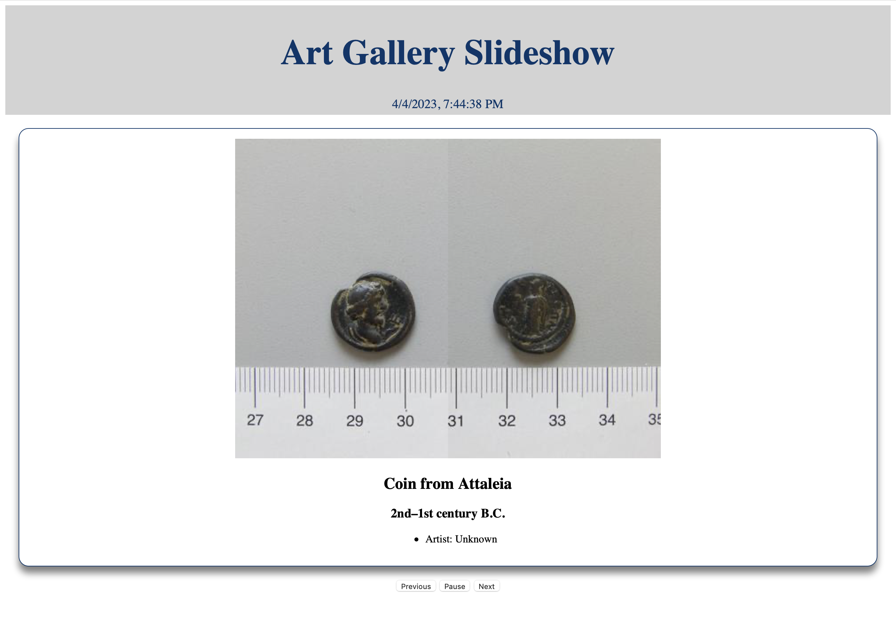

### Data Tier

The data tier of your application is the same `lux.sqlite` database as you've used for the Psets thus far.
Download it from Canvas and place it into your Git repository for the exam.

You will only need to focus on three tables for this exam: `objects`, `agents`, and `productions`.

### Application Tier

Compose a program named `runserver.py` with Python version 3.10 or higher.
When executed with `-h` as a command-line argument, the program must display the following help message describing the program's behavior:

```
$ python runserver.py -h
usage: runserver.py [-h] port

An object slideshow application.

positional arguments:
  port        the port at which the server should listen

optional arguments:
  -h, --help  show this help message and exit
```

> **Note**: The specific verbiage of this help message should be the default for your version of the `argparse` module, which differs slightly between Python versions.

Your `runserver.py` must run an instance of the Flask test server listening at all addresses on the specified port, which must in turn run your application.

> **Note**: Your application code should *not* be in your `runserver.py` program, which should do nothing but start the Flask server on the provided port number.
> The file containing your application code may be named whatever you want, but we suggest something simple such as `midterm.py`.
> You're free to use as many supporting files as you like, and we encourage at least one in addition to your main application program, although you will not be graded on code style or modularity.

### Presentation Tier

The presentation tier of the application must consist of a single HTML file named `index.html`, returned by an HTTP `GET` request to your server's root.
The page should never be entirely refreshed&mdash;only the "info card" portion of the page should change.
To make it clear that this is what's happening, the page must display the time at the browser's location of the most recent refresh of the webpage.

## Checkpoints
Below is a quick summary of the different checkpoints of the exam.
Details are in the associated sections.

1. [Checkpoint 1](#checkpoint-1): Display some information about a random object from the `lux.sqlite` database.
2. [Checkpoint 2](#checkpoint-2): Display some information about and an image of a random object from the `lux.sqlite` database.
3. [Checkpoint 3](#checkpoint-3): Add a "next" button to get information about a different random object from the database.
4. [Checkpoint 4](#checkpoint-4): Repeatedly retrieve another random object every so often, even if the "next" button is not clicked
5. [Checkpoint 5](#checkpoint-5): Add a "pause" button to pause the slideshow
6. [Checkpoint 6](#checkpoint-6): Add some style to the slideshow
7. [Checkpoint 7](#checkpoint-7): Add a "previous" button that returns to the previous image that was displayed in the slideshow

---
### Checkpoint 1: Display a Random Object



Your webpage must display, at the top of the page, a header with the title "Art Gallery Slideshow" and, below that, the time at the browser when this page was last refreshed.

> **Note**: The time should not be a "ticking clock"; the time should be set when the page is loaded and not changed until the page is loaded again.

Below the header,  `index.html` must display at least the following information about a random object in the `lux.sqlite` database.
* The object's label
* The object's date
* An unordered list of each agent that worked on the object, with each item formatted as `"{part}: {agent-name}"`, sorted in ascending order of the part and then in ascending order of the agent name

The object's information must be well-formatted, similar to the screenshot above.

For the purposes of this exam, by "random object" we mean "an object with a random object ID in the range of object ids".
Your server should compute that range just once on startup, either as a $[min, max]$ interval or as a `list` (or `set`) of all valid IDs (note, however, that object IDs in the database are not contiguous on the $[min, max]$ interval&mdash;there are some ids that are not associated with an object).

> **Note**: To generate a pseudo-random number in Python, use the [`random` module](https://docs.python.org/3/library/random.html) from the Python standard library.

---
### Checkpoint 2: Display an Image



The `index.html` page, in addition to satisfying the requirements of [Checkpoint 1](#checkpoint-1), must display an image of the object whose information is presented.
Images are not stored in the database directly.
Instead, they reside at URLs with a predictable format, given the object's ID:
```
https://media.collections.yale.edu/thumbnail/yuag/obj/{obj-id}
```

For example, here is the thumbnail for Vincent Van Gogh's Square Saint-Pierre Paris, at the URL `https://media.collections.yale.edu/thumbnail/yuag/obj/52916`:


The displayed image must be no more than `240px` high and have the same aspect ratio as the original (hint: read about the `max-height` and `max-width` style attributes).
 The image must also have an alt-text to aid in accessibility.
The alt-text for the image must be a string in the format `"{obj-label}, {obj-date}"`.

> **Note**: Some objects in the database do not have an associated thumbnail.
> Your application must be robust in this situation, displaying the image `/static/image_not_available.png` instead of an image of the actual object:
> 
>
> The "no image available" image must be no more than `240px` high, and must have the same alt-text as if there was an image of the object.

---
### Checkpoint 3: Next Button



In addition to the requirements for [Checkpoint 2](#checkpoint-2), your `index.html` page must also include a button below the information about the object labeled "Next".
When this button is clicked, the application must retrieve information about anothe random object in the database and update the displayed information accordingly (including the image).

Clicking the "Next" button must not refresh the webpage.
Instead, it must update only *part* of the webpage with the results from the request.
(For example, the contents of a `div` with `id="objectCard"`).

---
### Checkpoint 4: Automatic Slideshow

In addition to the requirements for [Checkpoint 3](#checkpoint-3), your `index.html` page must *automatically* retrieve information about a random object in the database at a regular interval&mdash;every 5 seconds.
Clicking the "Next" button must reset this timer, that is, if the "next" button is clicked 4 seconds after the most recent automatic retrieval, the next automatic retrieval must happn 5 seconds *after the button was clicked*, and not 5 seconds after the last automatic retrieval.
The behavior of the automatic retrieval must otherwise be identical to the behavior of clicking "Next".

---
### Checkpoint 5: Pause Button



In addition to the requirements for [Checkpoint 4](#checkpoint-4), your `index.html` page must have a second button, labeled "Pause", which when clicked stops all automatic retrievals of random objects.
When it is clicked, the pause button text must change to read "Resume".

When the button is clicked again (that is, when it is a "Resume" button), the automatic retrieval interval must restart, with the first retrieval occuring immediately and subsequent retrievals every 5 seconds thereafter.

The pause/resume button must appear on the screen immediately to the left of the "Next" button.

---
### Checkpoint 6: CSS



Create a file called `slideshow.css`, in which you will put the styles for your slideshow elements.
Here are the required style items:
* The header (both the title and the time) must have a `lightgray` background that spans the entire width of the screen, and the text must be centered on the screen
* The header (both the title and the time) must have a text color of `#00356b` (Yale blue), and the background must be seamless between the two parts of the header (see screenshot above)
* The text size for the title in the header must be `20pt` and the text size of the time must be `14pt`
* The object's information must have the appearance of a "card" (see screenshot above):
  * The displayed image must be no more than `480px` high and have the same aspect ratio as the original
  * The text and image must be centered in the card
  * It must have a `#00356b solid 1px` border with a `15px` corner radius
  * It must have `15px` padding on each side
  * It must have `20px` margin on each side
  * It must cast a 50% transparent `black` [drop shadow](https://developer.mozilla.org/en-US/docs/Web/CSS/filter-function/drop-shadow) `10px` directly below the card, blurred `6px`

Link the stylesheet with your `index.html` webpage, so that the styles you created are applied when that page is rendered.

> **Note**: The `flask` web server requires that stylesheets are in a folder named `static` (other files belong in the `static` folder, too, but stylesheets are the important ones for this exam).
> See the code from the CSS lecture for examples of how to structure your application. 

---
### Checkpoint 7: Previous Button



In addition to satisfying the requirements for [Checkpoint 6](#checkpoint-6), your `index.html` page must also have a button labeled "previous", which, when clicked, retrieves and displays information about the most recent object that was shown in the slideshow.

Clicking the "previous" button must *also* pause the automatic retrieval of object information, and the pause/resume button must change to reflect that fact.

The previous button must appear on screen immediately to the left of the pause/resume button, and the trio of buttons must be centered on the screen.
